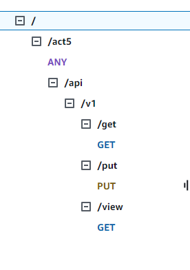

# **Title:** myDropbox:

**Description:**

myDropbox is a Python-based command-line application that allows you to securely manage your files through an API. It provides functionalities for:

- Creating new user accounts
- Logging in to existing accounts
- Uploading and downloading files
- Viewing a list of your files

**Installation:**

1. Clone this repository:

    ```bash
    git clone https://github.com/your-username/mydropbox.git
    ```

2. Install required dependencies:

    ```bash
    pip install -r requirements.txt
    ```

3. Create a `.env` file in the root directory of the project and add the following line:

    ```env
    API_GATEWAY=<your_api_gateway_url>
    ```

**Usage:**

1. Start the application:

    ```bash
    python myDropbox_CLI.py
    ```

2. Follow the on-screen instructions to create a new user account, log in, or use available commands:
    - `newuser username password password`: Create a new user
    - `login username password`: Log in to existing account
    - `put filename`: Upload a file
    - `get filename username`: Download a file
    - `view`: List your files
    - `quit`: Exit the application

# Api documentation
[this file](api-docs.md)

## **_Prerequisites_**

- AWS Account
- Amazon S3 bucket
- Amazon Lamda function configured with API Gateway \
    